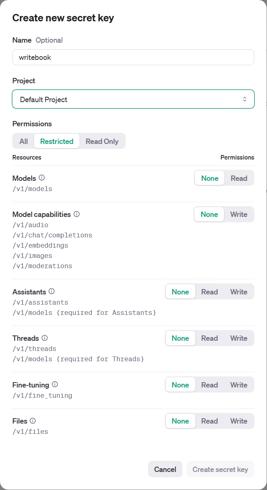

> The document is written by {{config.author}} it was generated on {{honkit.time}}, for any feedback on this article, please visit {{config.ref+file.path}}, or submit a discussion on {{config.discussion}}.

[](https://www.powershellgallery.com/packages/code365scripts.openai) [](https://www.powershellgallery.com/packages/code365scripts.openai)

## Overview

{{page.description}}

## Prerequisites

If you are a Windows user, like most people in the world, you have already installed PowerShell on your computer. The minimum version supported by this template is PowerShell 5.1, which comes with Windows 7, so you don't need to do any additional installation.
Of course, if you want to use the latest version of PowerShell on Windows, or if you want to use PowerShell on Linux or macOS, you can obtain the installation method from the official addresses below.

1. [Windows](https://learn.microsoft.com/en-us/powershell/scripting/install/installing-powershell-on-windows)
2. [Linux](https://docs.microsoft.com/zh-cn/powershell/scripting/install/installing-powershell-core-on-linux)
3. [macOS](https://docs.microsoft.com/zh-cn/powershell/scripting/install/installing-powershell-core-on-macos)

Another condition is that you need to have the OpenAI API Key, you can register an account on the [OpenAI official website](https://platform.openai.com/signup/), and then get your API Key on the [API page](https://platform.openai.com/api-keys) The API Key usually starts with "sk". You can also declare the corresponding permissions when creating the API Key.

> [!TIP] If you don't have the OpenAI API Key yet, you can register an account on the [OpenAI official website](https://platform.openai.com/signup/), and then get your API Key on the [API page](https://platform.openai.com/api-keys).



## Install the module

You can install the OpenAI PowerShell SDK through the PowerShell Gallery by running the following command:

```powershell
Install-Module -Name code365scripts.openai -Scope CurrentUser
```

## Update the module
